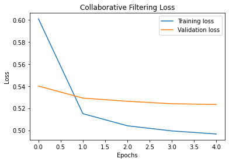
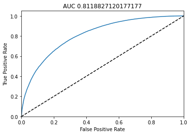
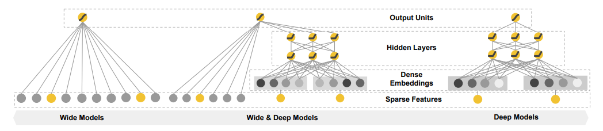
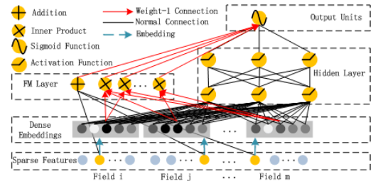
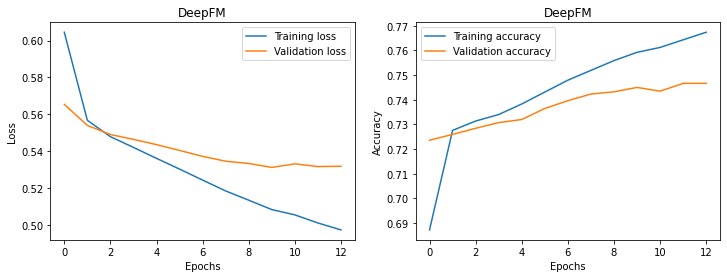
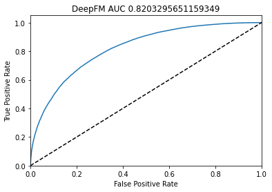

# Recommendation Systems
One of the most important applications of machine learning is recommendation system. In this repo, I compare the performance of 2 different recommender models on 
[MovieLens](https://www.kaggle.com/datasets/odedgolden/movielens-1m-dataset) dataset. The first model is a basic Collaborative Filtering model, and the second one is more 
complex [DeepFM](https://www.ijcai.org/proceedings/2017/0239.pdf) model.
## MovieLens 1M Dataset
MovieLens dataset is used for movie recommendation task. Dataset contains 1 million records as user movie ratings 1 to 5. Also, it includes contextual information of users such as gender, occupation, age etc., and genres for the movies. In this project, I used the dataset as binary classification task. Ratings below 4 are labeled as dislike(0), remaining ones are labeled as like(1). 
## Collaborative Filtering
Collaborative filtering uses the similarities between users and items to provide recommendations. It learns users and movie embeddings, so that there is no need to manual
feature engineering. Single emebedding vector can be thought as (1xm) feature vector where m is hyperparameter of the model. Collaborative filtering is classified into 2 categories as memory-based and model-based.  

**Memory Based:** Memory based approaches rely on similarity measures(cosine similarity, euclidean distance, jaccard similarity, etc.). For example, if we have a huge sparse matrix that has the users as rows and item ratings as columns. Similar users can be detected from the matrix by calculating similarity, and items can be recommended between the similar users.   

**Model Based:** Model based approach tries to fill the empty cells of the feedback matrix A(mxn) where m is the number of users and n is the number of items. They rely on matrix factorization.
* Learn user embedding matrix U(mxd) where i th row is the user embedding of the i th user and d is the embedding dimension.
* Learn item embedding matrix V(nxd) where i th row is the item embedding of the i th item and d is the embedding dimension.
* Finally, feedback matrix A can be factorized as A = U*VT

In this project, I conduct my experiments with a simple model based collaborative filtering. There 2 embedding layers for users and movies with a dimension of 64. In order to make a prediction, cosine similarity between user and movie embeddings are calculated. Normally, cosine similarity is between -1 and 1, since this is a classification task values are scaled to 0 and 1. If the similarity between the user and the movie embedding is close to 1, that means user will like the particular movie. Log loss is used as optimization objective. Model is trained with a learning rate of 0.5 for 5 epochs. Below figure shows the training metrics and auc of the test set.  

AUC score is calculated as 0.81 which is not that bad. 
## DeepFM
DeepFM arhitecture is developed after the [Wide & Deep](https://arxiv.org/pdf/1606.07792.pdf) model which is proposed by Google. Wide & Deep model arhitecture is shown in the below figure.  

It consist of 2 different parts as wide and deep. Wide and deep part of the network are jointly trained. Deep part is a simple feed forward neural network where the low dimensional dense embeddings of the features are learned. Deep part aims to capture the generalization. Generalization is the idea of exploring the new feature combinations that are never or rarely occured in the past. Wide part is a simple linear model. It aims to capture the memorization. Memorization is the idea of exploiting the correlation available in the historical data. The feature set of wide part consists of raw feature vectors and transformed feature vectors. The most important transformations is cross-product transformation. An example of cross-product transformation for a movie recommendation system can be given as AND(gender=male,like=Godfather). These transformations require overwhelming feature engineering and domain expertise. This is the time when DeepFM comes to play, and it eliminates the manual feature engineering.

DeepFM model architecture is shown in the below figure.  

As can be seen from the arhictecture, FM(wide) and deep part of the network shares the same input vector and embedding vector. Deep part of the architecture is straight forward dnn with embedding layers which compress highly sparse and super high dimensional feature vector into low dimension. After that these low dimensional feature vectors are fed through the later hidden layers. Deep part learns the high order feature interactions. FM part is a [factorization machines](https://cseweb.ucsd.edu//classes/fa17/cse291-b/reading/Rendle2010FM.pdf) that learns linear interactions and pairwise interactions as an inner product of feature latent vector. Deep and FM part of the model shares the same feature embeddings which brings huge befits such as;
* It can learn high and low feature from raw features
* There is no need manual feature engineering and domain expertise  

In order to train the model, I used [deepctr](https://github.com/shenweichen/DeepCTR) library. DNN architecture is set as (256,128,64) number of neurons each layer. Embedding dimension of the features is set to 16, and L2 regularization terms for embedding and dnn layer are set as 0.0001. Model is trained for 13 epochs with a learning rate of 0.001. The below figure depicts the training and validation metrics.  

Also, AUC score is calculated as 0.82 on the test set which is not that significant amount of improvement compared to the Collaborative Filtering model.   

## Further Improvement
If we look at the academia, the best performing models are the ones enhanced with knowledge-based graphs. Knowledge-based recommender systems utilizes the explicit information about the item, user etc. The following works are the examples of knowledge based grahs [KNI](https://arxiv.org/pdf/1908.04032v2.pdf), [RippleNet](https://arxiv.org/pdf/1803.03467v4.pdf), [MKR](https://arxiv.org/pdf/1901.08907v1.pdf). In order to get more accurate results, it is very promising to integrate the knowledge based graphs into the recommender systems. 
